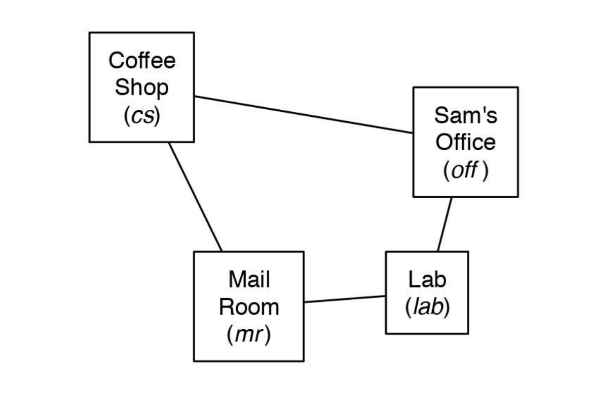

# Sprawozdanie
**Patryk Lesiak, Maciej Pieniążek**

## Cel ćwiczenia
Celem ćwiczenia jest przeprowadzenie planowania działań dla danego problemu w zdefiniowanej dziedzinie. 
W pierwszej części ćwiczenia zdefiniowana została dziedzina w której porusza się planner.
W kolejnym kroku nastąpiło znalezienie rozwiązania problemu przy pomocy *ForwardPlanner'a*
W ostatnim etapie porównano wersje standardowe z wersjami wykorzystującymi heurystyki.

## Opis dziedziny
Problem polega na sterowaniu robotem poruszającym się po czterech pokojach wykonując przy tym pracę dla właściciela - Sam'a. (Grafika 1)



Poniżej opisano dostępne akcje robota i stany problemu.

#### Stany
Nasz model zawiera 11 zdefiniowanych przez nas stanów. `RobLocation` przyjmuje wartości odpowiadające *pokojom* w modelu, pozostałe są typu *boolean*. Oprócz stanów z przykładu, dodaliśmy kilka swoich stanów, które mają za zadanie utrudnić rozwiązanie problemów.
```python
    'RobLocation':{'coffee_shop', 'office', 'lab', 'mail_box'},
    'RobHasCoffee':boolean,
    'SamWantsCoffee':boolean,
    'SamHasUnreadLetter':boolean,
    'SamHasLetter':boolean,
    'RobHasLetter':boolean,
    'TelevisionIsOn':boolean,
    'RobHasRemote':boolean,
    'RobHasBatteries':boolean,
    'RemoteHasWorkingBatteries':boolean,
    'RobEnergy':boolean
```

#### Akcje
Nasz robot *Rob* może wykonywać następujące akcje:
```python 
        Strips('mc_coffee_shop', {'RobLocation':'coffee_shop'}, {'RobLocation':'office'}),
        Strips('mc_office', {'RobLocation':'office'}, {'RobLocation':'lab'}),
        Strips('mc_lab', {'RobLocation':'lab'}, {'RobLocation':'mail_box'}),
        Strips('mc_mail_box', {'RobLocation':'mail_box'}, {'RobLocation':'coffee_shop'}),
        Strips('mcc_coffee_shop', {'RobLocation':'coffee_shop'}, {'RobLocation':'mail_box'}),
        Strips('mcc_office', {'RobLocation':'office'}, {'RobLocation':'coffee_shop'}),
        Strips('mcc_lab', {'RobLocation':'lab'}, {'RobLocation':'office'}),
        Strips('mcc_mail_box', {'RobLocation':'mail_box'}, {'RobLocation':'lab'}),
        Strips('get_coffee', {'RobLocation':'coffee_shop', 'RobHasCoffee':False, 'RobEnergy': True}, {'RobHasCoffee':True, 'RobEnergy': False}),
        Strips('give_coffee_sam', {'RobLocation':'office', 'RobHasCoffee':True}, {'RobHasCoffee':False, 'SamWantsCoffee':False}),
        Strips('get_mail', {'RobLocation':'mail_box','SamHasUnreadLetter':True, 'RobEnergy': True}, {'RobHasLetter':True,'SamHasUnreadLetter':False, 'RobEnergy': False}),
        Strips('give_mail_sam', {'RobLocation':'office', 'RobHasLetter':True}, {'RobHasLetter':False}),
        Strips('turn_on_television', {'RobLocation': 'office', 'RobHasRemote':True, 'RemoteHasWorkingBatteries': True, 'TelevisionIsOn':False}, {'TelevisionIsOn':True}),
        Strips('get_remote', {'RobLocation': 'lab', 'RobHasRemote':False, 'RobEnergy': True}, {'RobHasRemote':True, 'RobEnergy': False}),
        Strips('yeet_remote', {'RobHasRemote': True, 'RobLocation': 'mail_box'}, {'RobHasRemote': False}),
        Strips('put_in_batteries', {'RobHasBatteries':True, 'RobHasRemote': True}, {'RobHasBatteries': False, 'RemoteHasWorkingBatteries': True}),
        Strips('buy_batteries', {'RobLocation':'coffee_shop'}, {'RobHasBatteries': True}),
        Strips('charge', {'RobLocation':'lab', 'RobEnergy':False}, {'RobEnergy': True})
```

## Realizacja rozwiązania

Problem został rozwiązany przy pomocy biblioteki ai
```python
Poniżej znajduje się lista wykorzystanych klas

```

## Rozwiązywane problemy
### Problem 0 - 'Go to office'

*Rob* musi przejść z Laboratorium do Biura
#### Definicja problemu
```python
problem0 = Planning_problem(problem_domain,
    {
        'RobLocation':'lab',
        'SamHasUnreadLetter':True,
        'SamWantsCoffee':True,
        'RobHasCoffee':False,
        'RobHasLetter':False,
        'RobHasRemote':False,
        'TelevisionIsOn': False,
        'RobHasBatteries':False,
        'RemoteHasWorkingBatteries':False,
        'RobEnergy':True
    },
    {
        'RobLocation':'office'
    }
)
```

#### Heurestyka
```python
def heuristic_problem0(state, goal):
    return distance(state['RobLocation'],  goal['RobLocation'])
```

#### Rozwiązanie bez heurystyki
```bashbash
[Runner] Solving problem: Go to office [problem0]...
Solution:
   --mcc_lab--> (cost: 1)
 3 paths have been expanded and 4 paths remain in the frontier
[Runner] It took 0.009009122848510742s to find the solution in 100 iterations.
[Runner] One iteration took on average 9.009122848510742e-05s[Runner] Problem: Go to office [problem0] took 0.00901 (0.00009s on average) to solve.
[Runner] Problem: [Heuristic] Go to office [problem0] took 0.00500 (0.00005s on average) to solve.
Heuristic time difference: -0.00401, 80.050% faster
```

#### Rozwiązanie z heurystyką
```bashbash
[Runner] Solving problem: [Heuristic] Go to office [problem0]...
Solution: 
   --mcc_lab--> (cost: 1)
 2 paths have been expanded and 2 paths remain in the frontier
[Runner] It took 0.004004001617431641s to find the solution in 100 iterations.
[Runner] One iteration took on average 4.0040016174316406e-05s
```


### Problem 1 - 'Give Sam coffee'

*Rob* musi kupić Samiemu kawę
#### Definicja problemu
```python
problem1 = Planning_problem(problem_domain,
    {
        'RobLocation':'lab',
        'SamHasUnreadLetter':True,
        'SamWantsCoffee':True,
        'RobHasCoffee':False,
        'RobHasLetter':False,
        'RobHasRemote':False,
        'TelevisionIsOn': False,
        'RobHasBatteries':False,
        'RemoteHasWorkingBatteries':False,
        'RobEnergy':True
    },
    {
        'SamWantsCoffee':False
    }
)
```

#### Heurestyka
```python
def heuristic_problem1(state, goal):
    if state['SamWantsCoffee'] == False:
        return 0
    if state['SamWantsCoffee'] == True and state['RobHasCoffee'] == False:
        return distance(state['RobLocation'], 'coffee_shop') + 1 + distance('coffee_shop', 'office') + 1
    if state['RobHasCoffee'] == True:
        return distance(state['RobLocation'], 'office') + 1
```

#### Rozwiązanie bez heurystyki
```bash
[Runner] Solving problem: Give Sam coffee [problem1]...
Solution:
   --mc_lab-->
   --mc_mail_box-->
   --get_coffee-->
   --mc_coffee_shop-->
   --give_coffee_sam--> (cost: 5)
 49 paths have been expanded and 52 paths remain in the frontier
[Runner] It took 0.2874879837036133s to find the solution in 100 iterations.
[Runner] One iteration took on average 0.002874879837036133s
```

#### Rozwiązanie z heurystyką
```bash
[Runner] Solving problem: [Heuristic] Give Sam coffee [problem1]...
Solution:
   --mcc_lab-->
   --mcc_office-->
   --get_coffee-->
   --mc_coffee_shop-->
   --give_coffee_sam--> (cost: 5)
 6 paths have been expanded and 10 paths remain in the frontier
[Runner] It took 0.022543907165527344s to find the solution in 100 iterations.
[Runner] One iteration took on average 0.00022543907165527342s
```


### Problem 2 - 'Give Sam coffee and letter'

*Rob* musi kupić Samiemu kawę oraz przynieść mu pocztę.
#### Definicja problemu
```python
problem2 = Planning_problem(problem_domain,
    {
        'RobLocation':'lab',
        'SamHasUnreadLetter':True,
        'SamWantsCoffee':True,
        'RobHasCoffee':False,
        'RobHasLetter':False,
        'RobHasRemote':False,
        'TelevisionIsOn': False,
        'RobHasBatteries':False,
        'RemoteHasWorkingBatteries':False,
        'RobEnergy':True
    },
    {
        'SamWantsCoffee':False,
        'SamHasUnreadLetter':False,
        'RobHasLetter':False
    }
)
```

#### Heurestyka
```python
def heuristic_problem2(state, goal):
    if state['SamHasUnreadLetter'] == True and state['SamWantsCoffee'] == False:
        return 0
    
    if state['RobHasLetter'] == False and state['RobHasCoffee'] == False:
        return min( 
            distance(state['RobLocation'], 'mail_box') + 1 + distance('mail_box', 'coffee_shop') + 1 + distance('coffee_shop', 'office') ,
            distance(state['RobLocation'], 'coffee_shop') + 1 + distance('coffee_shop', 'mail_box') + 1 + distance('mail_box', 'office') ,
        ) + 1
    
    if state['RobHasLetter'] == False:
        return distance(state['RobLocation'], 'mail_box') + 1 + distance('mail_box', 'office') + 1
    
    if state['RobHasCoffee'] == False:
        return distance(state['RobLocation'], 'coffee_shop') + 1 + distance('coffee_shop', 'office') + 1
    
    return distance(state['RobLocation'], 'office')
```

#### Rozwiązanie bez heurystyki
```bash
[Runner] Solving problem: Give Sam coffee and letter [problem2]...
Solution:
   --mc_lab-->
   --get_mail-->
   --mcc_mail_box-->
   --charge-->
   --mc_lab-->
   --mc_mail_box-->
   --get_coffee-->
   --mc_coffee_shop-->
   --give_coffee_sam-->
   --give_mail_sam--> (cost: 10)
 222 paths have been expanded and 182 paths remain in the frontier
[Runner] It took 2.321424961090088s to find the solution in 100 iterations.
[Runner] One iteration took on average 0.023214249610900878s
```

#### Rozwiązanie z heurystyką
```bash
[Runner] Solving problem: [Heuristic] Give Sam coffee and letter [problem2]...
Solution: 
   --mc_lab-->
   --get_mail-->
   --mcc_mail_box-->
   --charge-->
   --mcc_lab-->
   --give_mail_sam-->
   --mcc_office-->
   --get_coffee-->
   --mc_coffee_shop-->
   --give_coffee_sam--> (cost: 10)
 544 paths have been expanded and 376 paths remain in the frontier
[Runner] It took 9.461572408676147s to find the solution in 100 iterations.
[Runner] One iteration took on average 0.09461572408676147s
```

### Problem 3 - 'Give Sam coffee, letter and turn on tv'

*Rob* musi zakupić kawę, odebrać pocztę, zdobyć pilot do telewizora,  następnie dostarczyć wszystko *Samy'emu* i włączć telewizor

#### Definicja problemu
```python
problem3 = Planning_problem( problem_domain,
    {
        'RobLocation':'coffee_shop',
        'SamHasUnreadLetter':True,
        'SamWantsCoffee':True,
        'RobHasCoffee':False,
        'RobHasLetter':False,
        'TelevisionIsOn': False,
        'RobHasRemote':False,
        'RobHasBatteries':False,
        'RemoteHasWorkingBatteries':False,
        'RobEnergy':True
    },
    {
        'SamWantsCoffee':False,
        'SamHasUnreadLetter':False,
        'RobHasLetter':False,
        'TelevisionIsOn': True,
        'RobHasRemote': False
    }
)
```

#### Heurestyka
```python
def heuristic_problem3(state, goal):
    if state['SamWantsCoffee'] == False and state['SamHasUnreadLetter'] == True and state['TelevisionIsOn'] == True:
        return 0
    
    if state['RobHasLetter'] == False and state['RobHasCoffee'] == False and state['RobHasRemote'] == False:
        return min(
            distance(state['RobLocation'], 'mail_box') + 1 + distance('mail_box', 'coffee_shop') + 1 + distance('coffee_shop', 'lab') + 1 + distance('lab', 'office'),
            distance(state['RobLocation'], 'mail_box') + 1 + distance('mail_box', 'lab') + 1 + distance('lab', 'coffee_shop') + 1 + distance('coffee_shop', 'office'), 
            distance(state['RobLocation'], 'coffee_shop') + 1 + distance('coffee_shop', 'mail_box') + 1 + distance('mail_box', 'lab') + 1 + distance('lab', 'office'), 
            distance(state['RobLocation'], 'coffee_shop') + 1 + distance('coffee_shop', 'lab') + 1 + distance('lab', 'mail_box') + 1 + distance('mail_box', 'office'), 
            distance(state['RobLocation'], 'lab') + 1 + distance('lab', 'coffee_shop') + 1 + distance('coffee_shop', 'mail_box') + 1 + distance('mail_box', 'office'),
            distance(state['RobLocation'], 'lab') + 1 + distance('lab', 'mail_box') + 1 + distance('mail_box', 'coffee_shop') + 1 + distance('coffee_shop', 'office'),
            ) + 1
    
    if state['RobHasLetter'] == False and state['RobHasCoffee'] == False:
        return min( 
            distance(state['RobLocation'], 'mail_box') + 1 + distance('mail_box', 'coffee_shop') + 1 + distance('coffee_shop', 'office'), 
            distance(state['RobLocation'], 'coffee_shop') + 1 + distance('coffee_shop', 'mail_box') + 1 + distance('mail_box', 'office')
            ) + 1
    
    if state['RobHasLetter'] == False and state['RobHasRemote'] == False:
        return min(
            distance(state['RobLocation'], 'mail_box') + 1 + distance('mail_box', 'lab') + 1 + distance('lab', 'office'),
            distance(state['RobLocation'], 'lab') + 1 + distance('lab', 'mail_box') + 1 + distance('mail_box', 'office'),
            ) + 1
    
    if state['RobHasRemote'] == False and state['RobHasCoffee'] == False:
        return min( 
            distance(state['RobLocation'], 'lab') + 1 + distance('lab', 'coffee_shop') + 1 + distance('coffee_shop', 'office'),
            distance(state['RobLocation'], 'coffee_shop') + 1 + distance('coffee_shop', 'lab') + 1 + distance('lab', 'office'),
            ) + 1
    
    if state['RobHasLetter'] == False:
        return distance(state['RobLocation'], 'mail_box') + 1 + distance('mail_box', 'office') + 1
    
    if state['RobHasCoffee'] == False:
        return distance(state['RobLocation'], 'coffee_shop') + 1 + distance('coffee_shop', 'office') + 1
    
    if state['RobHasRemote'] == False:
        return distance(state['RobLocation'], 'lab') + 1 + distance('lab', 'office') + 1
    
    return distance(state['RobLocation'], 'office') + 1
```

#### Rozwiązanie bez heurystyki
```bash
[Runner] Solving problem: Give Sam coffee, letter and turn on tv [problem3]...
   --get_coffee-->
   --buy_batteries-->
   --mcc_coffee_shop-->
   --mcc_mail_box-->
   --charge-->
   --get_remote-->
   --charge-->
   --mcc_lab-->
   --put_in_batteries-->
   --turn_on_television-->
   --mc_office-->
   --mc_lab-->
   --yeet_remote-->
   --get_mail-->
   --mcc_mail_box-->
   --mcc_lab-->
   --give_coffee_sam-->
   --give_mail_sam-->
 960 paths have been expanded and 274 paths remain in the frontier
[Runner] It took 17.626577615737915s to find the solution in 100 iterations.
[Runner] One iteration took on average 0.17626577615737915s
```

#### Rozwiązanie z heurystyką
```bash
[Runner] Solving problem: [Heuristic] Give Sam coffee, letter and turn on tv [problem3]...
   --buy_batteries--> 
   --mcc_coffee_shop-->
   --mcc_mail_box-->
   --charge-->
   --mc_lab-->
   --get_mail-->
   --mcc_mail_box-->
   --charge-->
   --get_remote--> 
   --charge--> 
   --mcc_lab--> 
   --give_mail_sam-->
   --give_coffee_sam-->
   --put_in_batteries-->
   --turn_on_television-->
   --mcc_office-->
   --get_coffee-->
   --yeet_remote--> (cost: 20)
 1052 paths have been expanded and 185 paths remain in the frontier
[Runner] It took 21.6063072681427s to find the solution in 100 iterations.
[Runner] One iteration took on average 0.216063072681427s
```

## Porównanie czasów dla wszystkich problemów

```bash
[Runner] Results for all problems:
[Runner] Problem: Go to office [problem0] took 0.00400 (0.00004s on average) to solve.
[Runner] Problem: [Heuristic] Go to office [problem0] took 0.00400 (0.00004s on average) to solve.
Heuristic time difference: +0.00000, 0.006% slower


[Runner] Problem: Give Sam coffee [problem1] took 0.29437 (0.00294s on average) to solve.
[Runner] Problem: [Heuristic] Give Sam coffee [problem1] took 0.02302 (0.00023s on average) to solve.
Heuristic time difference: -0.27135, 1178.702% faster


[Runner] Problem: Give Sam coffee and letter [problem2] took 2.46622 (0.02466s on average) to solve.
[Runner] Problem: [Heuristic] Give Sam coffee and letter [problem2] took 10.37460 (0.10375s on average) to solve.
Heuristic time difference: +7.90838, 76.228% slower


[Runner] Problem: Give Sam coffee, letter and turn on tv [problem3] took 18.93156 (0.18932s on average) to solve.
[Runner] Problem: [Heuristic] Give Sam coffee, letter and turn on tv [problem3] took 23.36940 (0.23369s on average) to solve.
Heuristic time difference: +4.43784, 18.990% slower
```